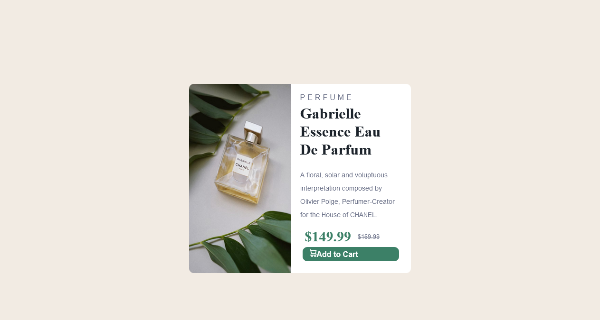

# Frontend Mentor - Product preview card component solution

This is my solution to the [Product preview card component challenge on Frontend Mentor](https://www.frontendmentor.io/challenges/product-preview-card-component-GO7UmttRfa).

## Table of contents

- [Overview](#overview)
  - [The challenge](#the-challenge)
  - [Screenshot](#screenshot)
  - [Links](#links)
- [My process](#my-process)
  - [Built with](#built-with)
  - [To Do](#to-do)
  - [Resources](#resources)
- [Author](#author)
- [Acknowledgments](#acknowledgments)

## Overview

### The challenge

Users should be able to:

- View the optimal layout depending on their device's screen size
- See hover and focus states for interactive elements

### Screenshot

So far this is what it looks like:

- Desktop: 
- Mobile (using Firefox's Responsive Design Mode, Samsung Galaxy S20): 
### Links

- [Solution](https://github.com/hennaoh/responsive-website-example)
- [Preview](https://your-live-site-url.com)

## My process

### Built with

- Semantic HTML5 markup
- CSS
- Flexbox
- Mobile-first workflow

### To Do

- Add corners to the mobile design.
- Figure out a way for `border-radius` to work in the Flex `.container` instead of doing it in the individual items.
- Figure out the proper size and centering for the 'Add to Cart' button.
- Add interactive elements (_hover_ and _focus_).
- Figure out why `src : local()` doesn't work even though I have Montserrat installed.

### Resources

- [A Complete Guide to Flexbox](https://www.css-tricks.com/snippets/css/a-guide-to-flexbox) - Really helped with understanding what works and where stuff should go and why. Unfortunately doesn't explain why `justify content` doesn't work.
- [MDN CSS Reference](https://developer.mozilla.org/en-US/docs/Web/CSS/Reference) - Very helpful for looking up properties and values. It also has examples, which helped a lot. 

## Author

- Frontend Mentor - [@theangelicme](https://www.frontendmentor.io/profile/theangelicme)
- Twitter - [@henna_senna](https://www.twitter.com/henna_senna)

## Acknowledgments

I humbly acknowledge [a certain individual](https://github.com/tundeonii) for pushing me to do this challenge and getting me back into web design.

